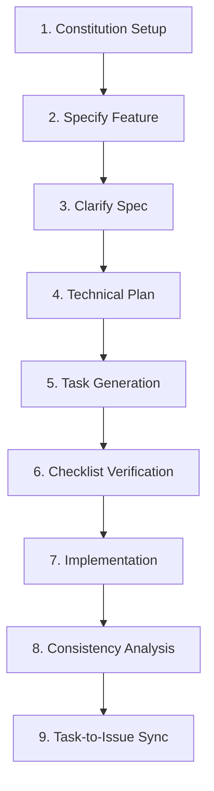

# Spec-Kit Implementation Guide & Prompt Templates

This guide provides structured prompt templates and instructions for using **spec-kit** in this repository. These templates ensure that all features implemented via the Spec-Kit pipeline meet professional standards, including complete documentation, TDD testing, linting/type-safety compliance, and architectural alignment.

---

## 🛠️ Spec-Kit Workflow Overview

The Spec-Kit cycle in this workspace consists of 9 integrated commands and workflows:



---

## 📋 Prompt Templates by Phase

### 1. Project Constitution Setup
**Command:** `/speckit-constitution`
**Goal:** Fill out `.specify/memory/constitution.md` to define project-wide standards that the agent must respect during implementation.

```text
Initialize and update the project constitution at `.specify/memory/constitution.md` with the following project context and technical principles:

PROJECT_NAME: "DevSecOps Security Scanning Pipeline"

Core Principles:
1. React 19 & TypeScript Frontend:
   - Use React 19, TypeScript, and Tailwind CSS.
   - Separate state and logic from presentation where possible.
   - All pages must use TanStack Query (@tanstack/react-query) for data fetching.
   - No `any` type is allowed. Explicit type hints and types from `src/types.ts` must be used.
   
2. Python FastAPI Backend:
   - Backend APIs must be built using Python FastAPI, SQLAlchemy, Celery, and Redis.
   - Strict adherence to PEP 8 standards with absolute imports starting with `app.`.
   - All routes (except auth/docs) must require a valid JWT or API key (checks localStorage first, then environment variables).
   - Only one active scan is allowed per project at a time (guarded by DB constraint `ix_scans_project_state`).

3. Test-Driven Development (TDD) & Verify-First:
   - Unit tests are non-negotiable. 
   - Backend tests must use `fastapi.testclient.TestClient` and pytest.
   - Frontend tests must use Vitest + JSDOM with configurations matching `src/test/setup.ts`.
   
4. Docker & Staging Environment:
   - Code must run in a Dockerized setup (dev, test, staging profiles managed by run.py).
   - Staging builds bake the frontend static assets into Nginx directly. DO NOT mount dynamic frontend assets in staging.
   - Database schemas, migrations, and docker environments must be checked.

Governance Rules:
- All changes must be verified using `npm run lint && npx tsc -b && npx vitest run && pytest tests/`.
- Maintain a version bump schema (MAJOR.MINOR.PATCH) for constitution updates.
```

---

### 2. Feature Specification (Specify)
**Command:** `/speckit-specify <Feature Description>`
**Goal:** Create a user-centric requirement specification under `specs/` (e.g., `specs/001-feature-name/spec.md`) that outlines *what* is needed and *why*, without leaking implementation details.

```text
/speckit-specify Build a Slack notification integration that triggers alert messages when a security scan fails or returns critical severity findings.
- The user should be able to configure Slack Webhook URLs in the project settings page.
- The notification must detail the Project Name, Scan Tool, and a summary of found vulnerabilities (grouped by severity: Critical, High, Medium, Low).
- The alerts should trigger asynchronously in the background so it doesn't block the scanning execution.
- Include failure tolerance (e.g., retry once if the Slack API returns a 5xx error, but don't crash the Celery worker).
- Ensure the success criteria are technology-agnostic and measurable. Specify error-handling edge cases and access controls (only project admins should edit webhook URLs).
```

---

### 3. Specification Clarification
**Command:** `/speckit-clarify`
**Goal:** Interactively answer any `[NEEDS CLARIFICATION]` markers inserted during the specify phase, modifying the spec to resolve ambiguities.

```text
/speckit-clarify
- Q1: Option A (Encrypt Slack Webhook URLs in the database using Fernet/AES before storing).
- Q2: Option B (Only send Slack notifications for scans triggered on default branch/staging, but let the user override it per scan request).
- Q3: Custom (Retry webhook calls up to 3 times with exponential backoff before marking notification task as FAILED).
```

---

### 4. Technical Design Planning
**Command:** `/speckit-plan`
**Goal:** Generate the technical plan (`plan.md`), including data models (`data-model.md`), API contracts (`contracts/`), and quickstart instructions.

```text
/speckit-plan
- Tech Stack constraints: FastAPI backend, SQLAlchemy PostgreSQL model, Celery background worker, React 19 settings page.
- Database changes: Add `slack_webhook_url` and `slack_notifications_enabled` fields to the Project model.
- Architecture: Create a new Celery task `send_slack_notification_task` in `backend/app/tasks/notifications.py` and register it in `backend/app/core/celery_app.py`.
- Gotcha Check: Keep in mind the project dual-scans module gotcha (`backend/app/api/scans.py` vs `backend/app/api/scans/`). If importing scans logic, verify which module is referenced.
- Ensure that the agent plan context in `AGENTS.md` is updated to link to the new plan file.
```

---

### 5. Detailed Task Generation
**Command:** `/speckit-tasks`
**Goal:** Break the plan down into sequential and parallel implementation steps formatted exactly as checklist checkboxes in `tasks.md`.

```text
/speckit-tasks
- Organize tasks strictly into:
  - Phase 1: Setup & Migrations
  - Phase 2: Foundational Backend Logic (Models, Celery notification tasks)
  - Phase 3: API Endpoints (Settings update & manual test notification endpoint)
  - Phase 4: Frontend UI (Slack Settings settings card & validation indicators)
  - Phase 5: Polish, Lint, and Validation
- Ensure all tasks follow the strict format: `- [ ] [TaskID] [P?] [Story?] Description with file path`.
- Explicitly request TDD-driven task generation: Each backend/frontend feature task must have a corresponding test creation task before it.
```

---

### 6. Specialized Quality Checklists
**Command:** `/speckit-checklist <arguments>`
**Goal:** Create quality assurance checklists (e.g., `security.md`, `ux.md`, `api.md`) under `checklists/` focusing on requirement quality (not implementation behavior).

```text
/speckit-checklist
- Type: security
- File: security.md
- Requirements Quality Focus: 
  - Ensure API endpoints validating/updating Webhook URLs have explicit authentication and permission checks.
  - Verify that credential storage (Webhook URL) encryption requirements are complete and unambiguous.
  - Ensure that network isolation rules (preventing SSRF attacks via malicious webhook URLs) are documented.
  - Include traceability references matching [Spec §X.Y] or [Gap] tags.
```

```text
/speckit-checklist
- Type: ux
- File: ux.md
- Requirements Quality Focus:
  - Ensure responsive layouts and breakpoint requirements are specified for the settings card.
  - Verify that visual feedback states (loading, success, error toast) are defined for testing the Slack webhook configuration.
  - Confirm keyboard navigation and a11y requirements are specified.
```

---

### 7. Execution & Implementation
**Command:** `/speckit-implement`
**Goal:** Automate the execution of tasks listed in `tasks.md`, updating files, executing tests, and verifying code quality.

```text
/speckit-implement
- Proceed with the implementation of tasks in order.
- Before writing code, verify that all prerequisites and checklist items are audited.
- Run `npm run lint` and `npx tsc -b` for frontend verification, and `pytest tests/` for backend verification.
- Make sure to update the checkbox states in `tasks.md` from `[ ]` to `[X]` as tasks are finished.
```

---

### 8. Consistency Auditing
**Command:** `/speckit-analyze`
**Goal:** Run a non-destructive check to ensure the specification, plan, checklists, and implementation remain in sync.

```text
/speckit-analyze
- Perform a consistency check across:
  - specs/00X-feature/spec.md
  - specs/00X-feature/plan.md
  - specs/00X-feature/tasks.md
- Identify any drift between the specifications and the implemented features.
- Highlight missing test coverage or undocumented variables.
```

---

### 9. Issues Synchronization
**Command:** `/speckit-taskstoissues`
**Goal:** Sync tasks in `tasks.md` to GitHub issues (or a local issue tracker database if integrated).

```text
/speckit-taskstoissues
- Sync all generated tasks in `tasks.md` into dependency-ordered issues.
- Preserve task descriptions, priorities, file paths, and parallel status [P].
```

---

## 💡 Best Practices for Spec-Kit in this Repository

1. **Leverage Docker Dev Environments:** When implementing, run `python run.py test` to start an isolated test database container so tests run in a clean environment.
2. **Follow Type Safety Rules:** Never use `any` in TypeScript files. When running `/speckit-implement`, check `npx tsc -b` frequently to catch compilation errors early.
3. **Respect database constraints:** One scan per project. When specifying scanner integrations or callback endpoints, ensure they do not create duplicate scans in `RUNNING` state, or if they do, implement force-unlock routines.
4. **Celery worker imports:** When writing new background tasks, ensure they are registered under `app/core/celery_app.py`, and the worker container is restarted if imports change.
